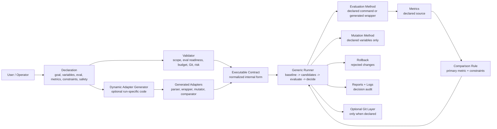

# AutoOptimize Architecture Overview

AutoOptimize is organized around a generic declaration-driven workflow.

The central question is not "which built-in scenario is this?" The central question is:

> Has the user declared what can change, how to evaluate it, how to compare results, and what must stay protected?

## System View

## Core Pieces

### Declaration

The declaration is the user-facing description of the optimization job.

It should capture:

- objective
- editable variables
- protected scope
- evaluation command
- metric extraction
- comparison rule
- constraints
- budget
- optional user-provided algorithm
- optional permission for generated adapters

The current `optimization.contract.yaml` can remain the executable internal form, but it should not be the only way users can express intent.

### Dynamic Adapters

AutoOptimize may generate temporary helper code when the declaration is clear but the user has not supplied an adapter.

Examples:

- parse metrics from stdout
- wrap an evaluation command
- mutate YAML, JSON, env vars, or CLI args
- normalize output into a metrics object
- compare results with user-declared rules

Generated adapters should live under `auto_optimize_outputs/generated_adapters/`, be recorded in reports, and stay inside the declared safety boundaries.

### Validator

The validator protects the user before experiments run.

It checks:

- workspace exists
- editable and protected scopes do not conflict
- evaluation path is protected
- variables point at allowed mutation targets
- required metrics can be found
- budgets and Git settings are safe
- generated adapter permissions are clear

### Generic Runner

The runner should not care whether the target project is FAQ retrieval, embedding search, prompt tuning, model selection, config tuning, or anything else.

It only needs:

- candidate variables
- mutation method
- evaluation method
- metrics
- comparison rule
- rollback scope

### Reports

Reports should answer:

- what was declared
- what code or adapters were generated
- what changed
- what metrics moved
- why candidates were accepted or rejected
- whether the final result should be adopted or reviewed

## Existing Examples

Existing examples are reference assets, not the product center.

- FAQ example: small local reference declaration and regression fixture.
- Benchmark examples: reference declarations for more complex evaluation data.
- Metric templates: optional comparison-rule examples.
- Dataset scripts: optional helper utilities.

AutoOptimize should remain useful when none of these examples match the user's project.

## Recommended Reading Order

1. [Generic Skill Direction](/Users/gavinzhang/ws-ai-recharge-2026/auto-optimize/docs/generic-skill-direction.md:1)
2. [Declaration Protocol](/Users/gavinzhang/ws-ai-recharge-2026/auto-optimize/docs/declaration-protocol.md:1)
3. [SKILL.md](/Users/gavinzhang/ws-ai-recharge-2026/auto-optimize/SKILL.md:1)
4. [README.md](/Users/gavinzhang/ws-ai-recharge-2026/auto-optimize/README.md:1)
5. [auto_optimize/runner/orchestrator.py](/Users/gavinzhang/ws-ai-recharge-2026/auto-optimize/auto_optimize/runner/orchestrator.py:1)
