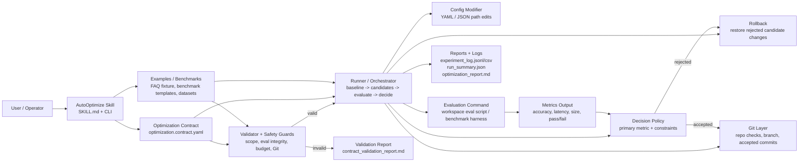
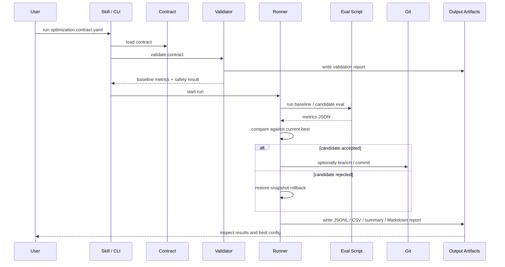

# AutoOptimize Architecture Overview

This page explains how the main parts of AutoOptimize fit together so a new collaborator can quickly answer:

- what the skill is responsible for
- what a contract controls
- where example benchmarks fit
- how the runner makes decisions
- what reports and Git records are produced

## System View

## Core Relationship

### 1. Skill

The skill is the top-level workflow surface.

- It defines the expected operator workflow in [SKILL.md](/Users/gavinzhang/ws-ai-recharge-2026/auto-optimize/SKILL.md:1).
- It exposes CLI entrypoints such as `validate` and `run` in [auto_optimize/cli.py](/Users/gavinzhang/ws-ai-recharge-2026/auto-optimize/auto_optimize/cli.py:1).
- It does not hardcode one specific retrieval or reranking system. Instead, it provides a reusable optimization engine.

In short:

- `skill = orchestration contract for humans and agents`

### 2. Contract

The contract is the job description for one optimization task.

It defines:

- which workspace to operate on
- which files are editable
- which files are protected
- which parameters may be changed
- how evaluation is run
- which metric is primary
- what constraints must never be violated
- whether Git controls are required

Relevant implementation:

- [auto_optimize/shared/schemas.py](/Users/gavinzhang/ws-ai-recharge-2026/auto-optimize/auto_optimize/shared/schemas.py:1)
- [auto_optimize/contract/loader.py](/Users/gavinzhang/ws-ai-recharge-2026/auto-optimize/auto_optimize/contract/loader.py:1)
- [auto_optimize/contract/validator.py](/Users/gavinzhang/ws-ai-recharge-2026/auto-optimize/auto_optimize/contract/validator.py:1)

In short:

- `contract = machine-readable optimization plan`

### 3. Example Benchmarks

Examples and benchmark templates provide runnable scenarios for the skill.

They answer:

- what kind of system are we optimizing
- what does the evaluation script emit
- which metric profile makes sense for this scenario

Current examples include:

- FAQ retrieval example: [examples/faq_retrieval/optimization.contract.yaml](/Users/gavinzhang/ws-ai-recharge-2026/auto-optimize/examples/faq_retrieval/optimization.contract.yaml:1)
- Benchmark templates: [examples/benchmarks/README.md](/Users/gavinzhang/ws-ai-recharge-2026/auto-optimize/examples/benchmarks/README.md:1)
- Metric templates: [examples/metric_templates/README.md](/Users/gavinzhang/ws-ai-recharge-2026/auto-optimize/examples/metric_templates/README.md:1)

In short:

- `examples/benchmarks = testbeds that the skill can optimize`

### 4. Runner

The runner turns a validated contract into actual experiments.

Current MVP flow:

1. Run baseline evaluation.
2. Generate one-variable-at-a-time candidates from `search_space`.
3. Modify the target YAML/JSON config field.
4. Execute the evaluation command.
5. Compare metrics against the current best result.
6. Accept or reject the candidate.
7. Roll back rejected changes.
8. Write experiment artifacts.

Relevant modules:

- [auto_optimize/runner/orchestrator.py](/Users/gavinzhang/ws-ai-recharge-2026/auto-optimize/auto_optimize/runner/orchestrator.py:1)
- [auto_optimize/runner/planner.py](/Users/gavinzhang/ws-ai-recharge-2026/auto-optimize/auto_optimize/runner/planner.py:1)
- [auto_optimize/runner/modifier.py](/Users/gavinzhang/ws-ai-recharge-2026/auto-optimize/auto_optimize/runner/modifier.py:1)
- [auto_optimize/runner/evaluator.py](/Users/gavinzhang/ws-ai-recharge-2026/auto-optimize/auto_optimize/runner/evaluator.py:1)
- [auto_optimize/runner/decision.py](/Users/gavinzhang/ws-ai-recharge-2026/auto-optimize/auto_optimize/runner/decision.py:1)
- [auto_optimize/runner/rollback.py](/Users/gavinzhang/ws-ai-recharge-2026/auto-optimize/auto_optimize/runner/rollback.py:1)

In short:

- `runner = experiment execution engine`

### 5. Report

Reports make the run understandable after the fact.

Current outputs include:

- validation report
- experiment JSONL log
- experiment CSV log
- run summary JSON
- Markdown optimization report

Relevant module:

- [auto_optimize/reporting/report_generator.py](/Users/gavinzhang/ws-ai-recharge-2026/auto-optimize/auto_optimize/reporting/report_generator.py:1)

In short:

- `report = audit trail for what happened and why`

### 6. Git

Git is the safety and traceability layer around accepted changes.

When enabled by the contract, AutoOptimize can:

- verify the workspace is a Git repo
- require a clean worktree
- create a local optimization branch
- commit accepted changes
- record branch and commit metadata in the run summary

Relevant module:

- [auto_optimize/shared/git.py](/Users/gavinzhang/ws-ai-recharge-2026/auto-optimize/auto_optimize/shared/git.py:1)

In short:

- `git = versioned checkpoint and audit layer`

## How A Real Run Connects These Pieces

## Mental Model

If you want the shortest possible description, use this:

- `skill` tells people and agents how to use AutoOptimize
- `contract` tells AutoOptimize what it is allowed to optimize
- `example benchmark` gives AutoOptimize a realistic scenario to operate on
- `runner` performs the actual experiments
- `report` explains what happened
- `git` makes accepted changes traceable and reviewable

## Recommended Reading Order

For someone new to the repo, this is the fastest path:

1. [SKILL.md](/Users/gavinzhang/ws-ai-recharge-2026/auto-optimize/SKILL.md:1)
2. [README.md](/Users/gavinzhang/ws-ai-recharge-2026/auto-optimize/README.md:1)
3. [examples/faq_retrieval/optimization.contract.yaml](/Users/gavinzhang/ws-ai-recharge-2026/auto-optimize/examples/faq_retrieval/optimization.contract.yaml:1)
4. [auto_optimize/contract/validator.py](/Users/gavinzhang/ws-ai-recharge-2026/auto-optimize/auto_optimize/contract/validator.py:1)
5. [auto_optimize/runner/orchestrator.py](/Users/gavinzhang/ws-ai-recharge-2026/auto-optimize/auto_optimize/runner/orchestrator.py:1)
6. [docs/benchmark-metrics.md](/Users/gavinzhang/ws-ai-recharge-2026/auto-optimize/docs/benchmark-metrics.md:1)
