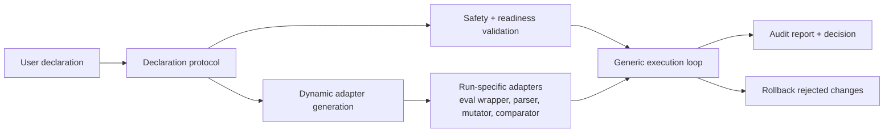

# Generic Skill Direction

AutoOptimize is a generic optimization skill. It should not become a large static collection of special-case scenarios.

The intended user experience is:

> The user declares the goal, variables, safety boundaries, evaluation method, metrics, and comparison rules. AutoOptimize validates those declarations, generates temporary helper code when needed, runs controlled experiments, and reports whether the result improved.

## What The Skill Is

AutoOptimize is an agentic optimization workflow for measurable project changes.

It is useful when a user can answer:

- What are we trying to improve?
- Which variables may change?
- Which files, data, commands, or secrets are protected?
- How do we run evaluation?
- Where do metrics come from?
- Which metric or rule decides improvement?
- What constraints must not regress?
- What budget or stopping condition applies?

## What The Skill Is Not

AutoOptimize is not:

- a benchmark dataset collection
- an embedding-specific optimizer
- a reranking-specific optimizer
- a provider catalog
- a static scenario template library
- a tool that forces user projects into prebuilt shapes

Those assets can exist as reference examples and tests, but they must stay secondary.

## Core Architecture

## Declaration First

The declaration is the main product artifact. The current contract can remain as the executable internal form, but users should not need to think in terms of hardcoded scenarios.

A declaration should be able to express:

- a config optimization task
- a prompt optimization task
- a model parameter search
- a workflow setting change
- a test command comparison
- a custom script evaluation

without requiring the user to call it FAQ, embedding, reranking, or benchmark.

## Dynamic Code Generation

When the user has supplied the required declarations but not a ready-made adapter, the skill may generate temporary code.

Examples:

- parse metrics from stdout
- wrap a shell command and normalize JSON output
- edit a YAML, JSON, env, or CLI argument value
- compare a primary metric plus constraints
- run a small repeated-eval stability check

Generated code must be:

- scoped to the run output directory
- recorded in the report
- validated against protected scope rules
- reviewed or confirmed when it introduces higher risk

## Examples Are References

Existing examples are still useful. Their role is to demonstrate declarations and protect regressions.

They are not the direction of the product:

- FAQ example demonstrates a small local declaration.
- Benchmark examples demonstrate more complex evaluation data.
- Metric profiles demonstrate comparison-rule patterns.
- Provider examples demonstrate adapter implementation patterns.

The skill should remain useful even when none of those examples match the user's project.
